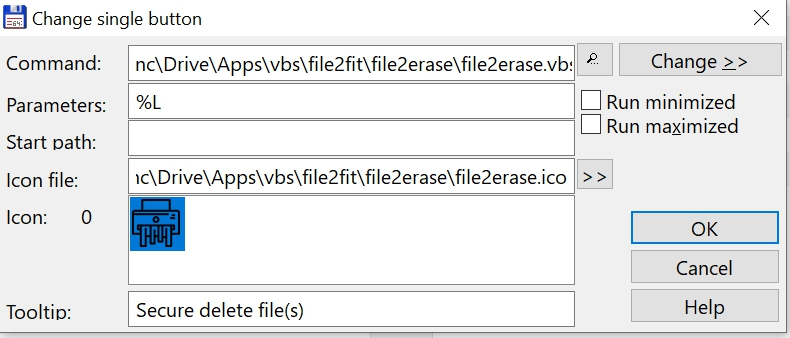

# File2erase

Secure delete one or more files. The utility is based on MicroSoft utility SDelete.exe:
https://docs.microsoft.com/en-us/sysinternals/downloads/sdelete

The only way to ensure that deleted files, as well as files that you encrypt with EFS, are safe from recovery is to use a secure delete application. Secure delete applications overwrite a deleted file's on-disk data using techniques that are shown to make disk data unrecoverable, even using recovery technology that can read patterns in magnetic media that reveal weakly deleted files. SDelete (Secure Delete) is such an application.

## Install instructions

* Copy the folder file2erase into a folder of your choice
* Make a new entry in the TC button bar (Configuration, Button Bar)
    - at the command line: fill in the path to the file2erase.vbs file
    - for parameters fill in: %L
    - for icon file: fill in the path to the file2erase.ico file
    - for tooltip fill in the text: Secure delete file(s)
    - see screenshot

## Usage

* Use with care: erased files and folders cannot be recovered!
