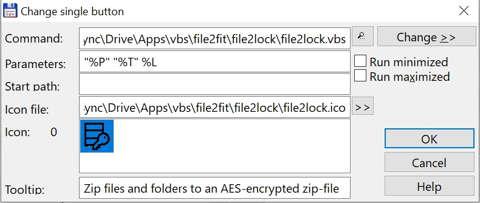

# File2lock

Zip and encrypt 1 or more files and/or folders. Select all the items you want to add in the zip-file and click the icon in the TC-Button Bar. If you do not fill in a password the result will be a normal zip-file (format: 7zip). If you fill in a password the zipfile will be encrypted with the AES-algorithm. The AES encryption algorithm is a "block cipher" originally created by two Belgians named Joan Daemen and Vincent Rijmen. Since its adoption as a standard, AES has become one of the world's most popular encryption algorithms that uses symmetric keys for encryption and decryption.

https://www.7-zip.org/

## Install instructions

* Copy the folder file2lock into a folder of your choice
* Make a new entry in the TC button bar (Configuration, Button Bar)
    - at the command line: fill in the path to the file2lock.vbs file
    - for parameters fill in: "%P" "%T" %L
    - for icon file: fill in the path to the file2lock.ico file
    - for tooltip fill in the text: Zip files and folders to an AES-encrypted zip-file
    - see screenshot

