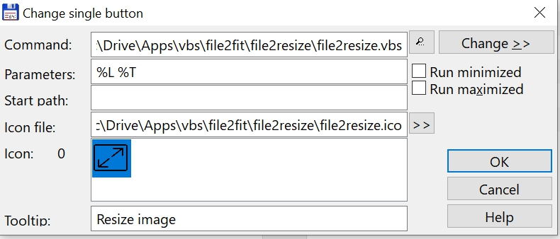

# File2resize

Resize 1 or more image files. The files are resized with the program IrfanView. 

https://www.irfanview.com/

## Install instructions
* Copy the folder file2resize into a folder of your choice
* Make a new entry in the TC button bar (Configuration, Button Bar)
    - at the command line: fill in the path to the file2resize.vbs file
    - for parameters fill in: %L %T
    - for icon file: fill in the path to the file2resize.ico file
    - for tooltip fill in the text: Resize image(s)
    - see screenshot

