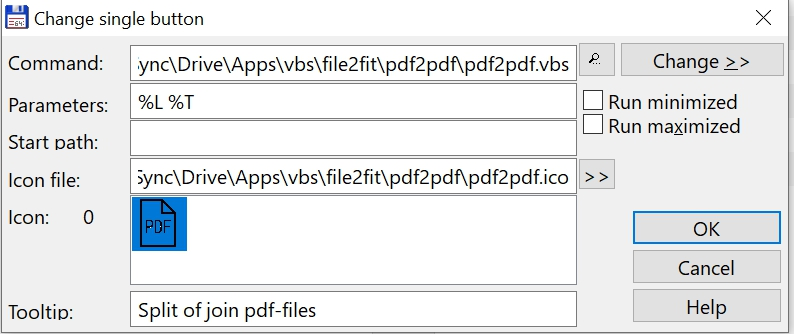

# Pdf2pdf

Split pdf-file or join pdf-files to one pdf-file. The utility is based on the PDF Toolkit Free:

https://www.pdflabs.com/tools/pdftk-the-pdf-toolkit/
PDFtk Free is our friendly graphical tool for quickly merging and splitting PDF documents and pages. It is free to use for as long as you like.

## Install instructions

* Copy the folder pdf2pdf into a folder of your choice
* Make a new entry in the TC button bar (Configuration, Button Bar)
    - at the command line: fill in the path to the pdf2pdf.vbs file
    - for parameters fill in: %L %T
    - for icon file: fill in the path to the pdf2pdf.ico file
    - for tooltip fill in the text: Split pdf-file or join pdf-files
    - see screenshot

## Usage
* If you select one pdf-file the program will split it in a pdf-file for every page.
* If you select more than one pdf-file the program will join the files to one pdf-file in the order as listed in TC.
